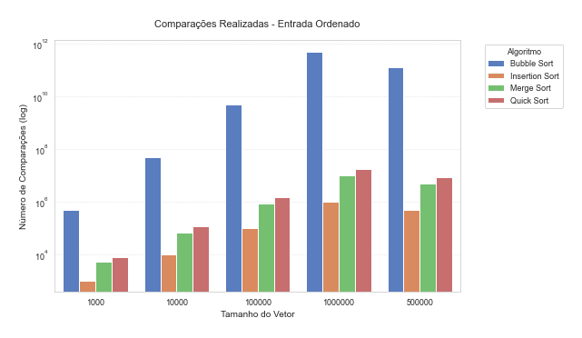
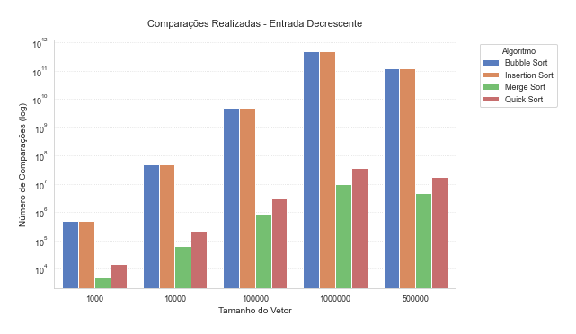
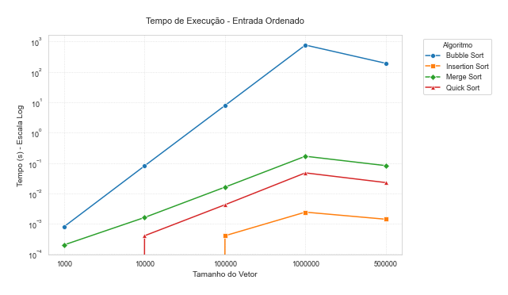
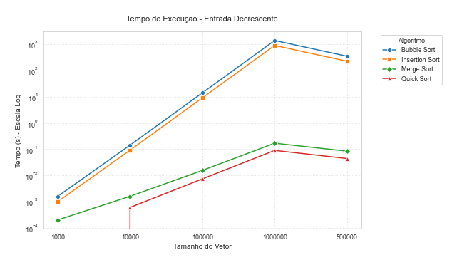
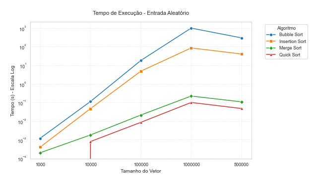

# Análise e Comparação de Algoritmos de Ordenação em C

## Objetivo
Implementar e comparar diferentes algoritmos de ordenação em C, avaliando-os com base em:
- Tempo de execução
- Número de comparações realizadas

## Algoritmos Implementados
- Bubble Sort
- Insertion Sort
- Merge Sort
- Quick Sort

## Tipos de entrada geradas

- Ordenado crescente (`sorted`)
- Ordenado decrescente (`reverse`)
- Aleatório (`random`)

## Estrutura de Diretórios

- Algoritmos :
     - bubble_sort.c
     - insertion_sort.c
     - merge_sort.c
     - quick_sort.c
- Entradas : Entradas geradas como sorted, random e reverse entre 1000, 10000, 100000, 500000, 1000000;
- Graficos :
     - graficos.py : Codigo para criação dos graficos.
     - resultados_graficos : Primeiro arquivo de teste
     - resultados_graficos_5rep : Primeiro arquivo de resultados com 5rep
- Resultados:
     - resultados.csv : Rewsultados com 1rep
     - resultados_3rep.csv : Resultados com 5rep
- Utils:
     - gerar_entradas.c : Gerador de entradas
     - medir_performance.c : Medir a Performance

## Como Executar

1. **Clone o repositório:**
   ```bash
   git clone https://github.com/A-juli07/Analise_Comparacao_Ordenacao_AnaliseDeAlgoritmos.git

2. **Gerar arquivos de entrada**
   ```bash
   gcc utils/gerar_entradas.c -o gerar_entradas
   ./gerar_entradas

3. **Executar os algoritmos e salvar os dados**
   ```bash
   gcc utils/medir_performance.c algoritmos/*.c -o medir
   ./medir

4. **Gerar os gráficos (requer Python)**
   ```bash
   pip install pandas matplotlib
   python graficos/graficos.py

## Ambiente de Execução
Os testes foram executados em um ambiente contendo Sistema Operacional
Windows 11 Home 64 bits. Nossa plataforma de testes foi um computador com processador Processador AMD Ryzen 5 5600, 3.5GHz (4.4GHz Turbo), 6-Cores 12-Threads,
Memória DDR4, 16GB, 3733Mhz, SSD 500GB Leitura 4800MBs e Gravação 2700MBs e Placa de Vídeo MSI NVIDIA GeForce RTX 3060 VENTUS 2X OC, LHR, 12GB GDDR6, DLSS, Ray Tracing.

## Saída

Arquivo CSV com resultados: resultados/resultados.csv

Gráficos gerados na pasta graficos/:

- tempo_random.png, comparacoes_random.png
- tempo_sorted.png, comparacoes_sorted.png
- tempo_reverse.png, comparacoes_reverse.png

## Insights dos Resultados

### Número de Comparações(log) X Tamanho do Vetor
#### Entrada Ordenada
  

  
**Insertion Sort** destaca-se: faz apenas ~𝑛–1 comparações (linear), ficando absurdamente abaixo de todos os demais no eixo log.

**Bubble Sort** continua O(𝑛²) mesmo em vetor já ordenado (pois a implementação não interrompe cedo), explodindo no número de comparações conforme 𝑛 cresce.

**Merge Sort e Quick Sort** apresentam comportamento típico O(𝑛 log 𝑛), quase sobrepostos no gráfico, com Quick Sort ligeiramente acima de Merge (devido às pequenas variações no particionamento), mas ambos muito mais eficientes que Bubble/Insertion para grandes 𝑛.

#### Entrada Decrescente


  
**Insertion Sort** sofre o seu pior caso: também O(𝑛²), fazendo quase tantas comparações quanto o **Bubble Sort**. No gráfico, Bubble e Insertion praticamente coincidem, ambos estourando no topo.

**Quick Sort** ainda mantém O(𝑛 log 𝑛) médio, mas cresce um pouco mais que Merge Sort (que é estável O(𝑛 log 𝑛) sempre), pois a escolha de pivô no pior caso decrescente pode gerar partições desequilibradas.

**Merge Sort** mantém-se mais baixo que Quick Sort e muito abaixo dos quadráticos, reafirmando sua robustez contra ordenações adversas.

#### Entrada Aleatória


**Bubble Sort e Insertion Sort** continuam O(𝑛²), com Bubble sempre pior que Insertion para todos os tamanhos. Mesmo com vetores de meio milhão, suas curvas disparam no eixo log.

**Merge Sort e Quick Sort** mostram novamente curvas alinhadas em O(𝑛 log 𝑛): Quick Sort um pouco acima de Merge em média, mas ambos escalando com muito mais eficiência.

A distância entre os quadráticos e os log-lineares ilustra claramente o ponto de ruptura onde algoritmos O(𝑛²) deixam de ser viáveis em entradas grandes, enquanto O(𝑛 log 𝑛) se mantém confortável.

#### Insights Geral 
Quando colocamos todos esses algoritmos lado a lado, percebemos que Bubble e Insertion disparam no número de comparações conforme o vetor cresce, virando um pesadelo já em tamanhos médios.
Em contrapartida, Merge e Quick escalam de forma muito mais suave graças ao comportamento n·log(n), com Merge sendo mais previsível e Quick um pouco mais sensível à escolha do pivô.
Na prática, isso quer dizer que, para qualquer aplicação real com milhares de elementos, é quase sempre melhor apostar em um algoritmo Θ(n log n).
Só vale recorrer ao quadrático se você tiver listas bem pequenas ou quase ordenadas, caso contrário logo vai sentir o calo de uma execução lenta.

### Tempo X Tamanho do Vetor
#### Entrada Ordenada



**Insertion Sort**: Tempo em torno de 1 ms mesmo para vetor de 1 000 000 elementos (faz apenas _n–1_ comparações).

**Bubble Sort**: Crescimento quadrático sem “break” antecipado, alcançando entre 100 s e 1000 s para 1 000 000 elementos.

**Merge Sort** e **Quick Sort**: ~0,01 s a 0,1 s em 100 000 elementos, 1 s a 10 s em 1 000 000 elementos. **Quick Sort** é ligeiramente mais rápido que Merge Sort (menor sobrecarga de mesclagem).

#### Entrada Decrescente



**Bubble Sort** e **Insertion Sort**: Pior caso quadrático, ambos chegam a 100 s–1000 s em 1 000 000 elementos (Bubble Sort um pouco mais lento).

**Quick Sort**: ~0,01 s a 0,1 s em 100 000 elementos, 1 s a 10 s em 1 000 000 elementos. Sofre maior variação por pivôs desequilibrados.

**Merge Sort**: Comportamento estável O(𝑛 log 𝑛): ~0,1 s em 100 000 elementos e alguns segundos em 1 000 000, sempre ligeiramente acima do Quick Sort.

#### Entrada Aleatória



**Bubble Sort** e **Insertion Sort**: Impraticáveis para vetores grandes: Bubble Sort chega a 100 s–1000 s e Insertion Sort a dezenas de segundos em 1 000 000 elementos.

**Quick Sort**: 1 ms–10 ms em 100 000 elementos, ~1 s em 1 000 000 elementos. Melhor performance média entre os O(𝑛 log 𝑛).

**Merge Sort**: ~10 ms–100 ms em 100 000 elementos, 1 s–10 s em 1 000 000 elementos. Levemente mais lento que Quick Sort, mas ainda muito mais rápido que quadráticos.

#### Insights Geral 
Para vetores grandes (a partir de 100 000 elementos), só faz sentido usar algoritmos como Merge Sort e Quick Sort, que crescem de forma muito mais suave do que o quadrático. Na prática, o Quick Sort costuma ser o mais rápido no dia a dia, mas o Merge Sort é mais estável — você evita surpresas de pior caso. Já o Insertion Sort só vale a pena em listas bem pequenas ou quase ordenadas, e o Bubble Sort… bom, esse serve mais como exemplo didático do que como solução real.

## Autores

Ana Julia Vieira P.A. Costa e
Gabriel Menezes
